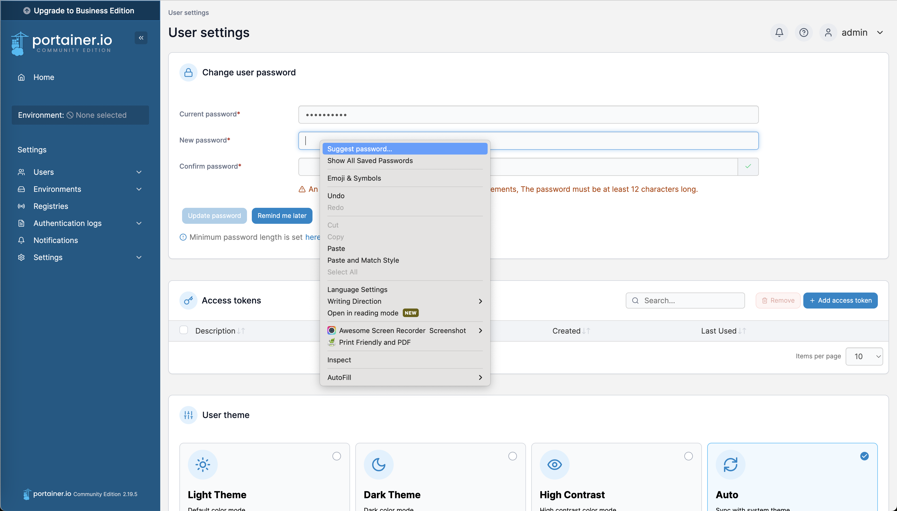
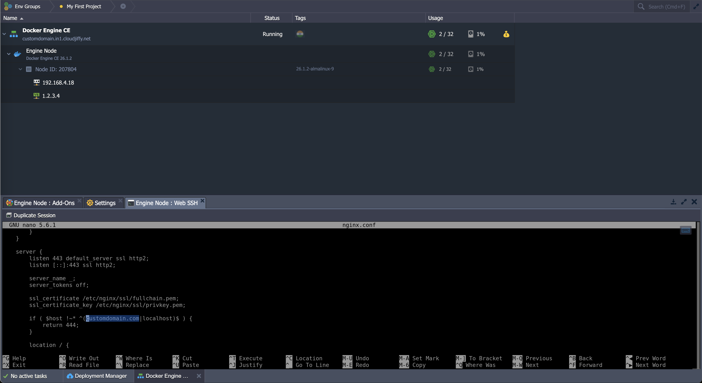

# jeldock
Docker yml example run docker with configured ssl on Jelastic Environment

1. Click on `New Environment`
   </br>
   

2. Click the small `arrow down`near the `Custom`container
   </br>
   

3. Select `Docker container`
   </br>
   

4. Select `Create a clean standalone engine` and
   check the `Install Portainer UI and Let's Encrypt SSL certificates` checkbox option
   </br>
   

5. Inside of your DNS domain records settings page edit the A record and make it point this docker environment
   (here as example we assume that it is 1.2.3.4,
   you can easily take your public IP from jelastic,
   it's shown in green on the platform, see next point image to understand)
   </br>
   

6. Click on the Add-Ons button of the created container,
   then click `Configure` inside of the `Let's Encrypt Free SSL` Add-On.
   Then when required specify your own `customdomain.com`
   </br>
   

7. Go on environment settings (through the yellow gear near the `Docker Engine CE`):
   click on `Custom Domains`, add your own `customdomain.com` as point 2 and click `Bind`
   </br>
   

8. Access to Portainer through provided credentials
   </br>
   

9. Change password as requested, I suggest you to use a browser generated strong password as a new password
   </br>
   

10. Open terminal on the environment (`Web SSH`) and run `git clone https://github.com/danielemaddaluno/jeldock` (for a private repo you'll need a [token](https://stackoverflow.com/a/70320541/3138238))
    then move inside ot the folder using a `cd jeldock`
    </br>
    
    Read this only if you need to checkout a different branch (not main), otherwise go to the next point.
    These are useful commands to check all branches and checkout a specific branch:
   ```
   git clone https://github.com/danielemaddaluno/jeldock
   cd jeldock
   git fetch
   git branch -a
   git checkout -b Feature-ForPortainer remotes/origin/feature/Feature-ForPortainer
   ```
11. Then `cd servers_nginx`, `nano nginx.conf` and change the line where `customdomain.com` with your own domain name (see the image to check what part has to be updated with your own domain name)
    </br>
    

12. Now go back in jelastic folder (`cd ..`) and run a `docker-compose up` to run the stack (you can monitor it from Portainer at `customdomain.com:4848`)
    </br>
    

13. The stack is created (pulled containers) and run
    </br>
    

14. If everything is ok you should see this at `https://customdomain.com`
    </br>
    

15. Finally add some rules to your firewall to protect Portainer (check the lines with priority 100 and 99).
    Here as example the IP 10.11.12.13 is considered to be your Work IP and with these rules it will be the only one to accept requests on the port 4848.
    This are some strongly suggested rules to improve security of your site
    </br>
    